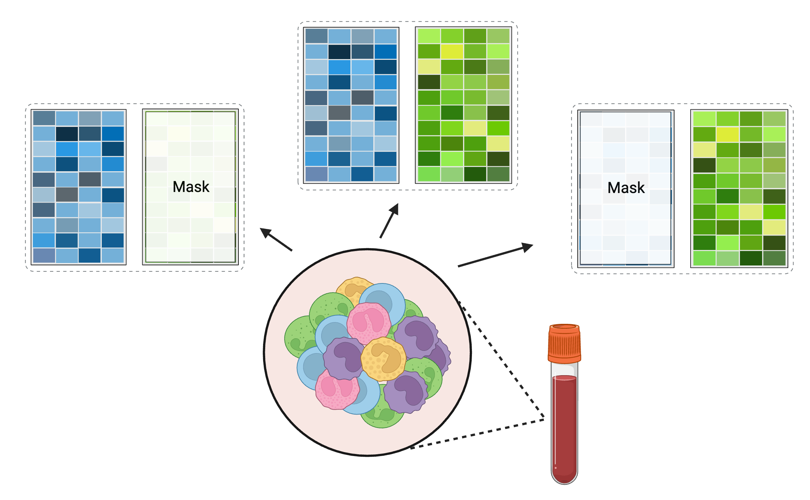

<!-- Improved compatibility of back to top link: See: https://github.com/othneildrew/Best-README-Template/pull/73 -->
<a name="readme-top"></a>


<!-- PROJECT SHIELDS -->
<!--
*** I'm using markdown "reference style" links for readability.
*** Reference links are enclosed in brackets [ ] instead of parentheses ( ).
*** See the bottom of this document for the declaration of the reference variables
*** for contributors-url, forks-url, etc. This is an optional, concise syntax you may use.
*** https://www.markdownguide.org/basic-syntax/#reference-style-links
-->

<!-- PROJECT LOGO -->
<div align="center">
    <h3 align="left">
        <a href="https://github.com/yuemolin/MOFUN-CCC">
            
        </a>
    </h3>
    <h3 align="center" style="font-size: 30px;">MOFUN-CCC</h3>
    <p align="center" style="font-size: 20px;">
        <strong>M</strong>ulti <strong>O</strong>mics <strong>FU</strong>sion neural <strong>N</strong>etwork - <strong>C</strong>omputational <strong>C</strong>ell <strong>C</strong>ounting
    </p>
    <p>
        MOFUN-CCC is a multi-modal deep learning algorithm that operates under a supervised framework, leveraging intermediate fusion techniques to process bulk gene expression and bulk DNA methylation data. Its primary objective is to generate absolute cell counts as its output.
        <br />
        <a href="https://github.com/othneildrew/Best-README-Template/issues">Report Bug
        </a>
        ·
        <a href="https://github.com/othneildrew/Best-README-Template/issues">Request Feature
        </a>
    </p>
</div>


<!-- TABLE OF CONTENTS -->
<details>
  <summary>Table of Contents</summary>
  <ol>
    <li>
      <a href="#Introduction">Introduction</a>
    </li>
    <li>
      <a href="#getting-started">Getting Started</a>
      <ul>
        <li><a href="#prerequisites">Prerequisites</a></li>
        <li><a href="#installation">Installation</a></li>
      </ul>
    </li>
    <li><a href="#usage">Usage</a></li>
    <li><a href="#roadmap">Roadmap</a></li>
    <li><a href="#contributing">Contributing</a></li>
    <li><a href="#license">License</a></li>
    <li><a href="#contact">Contact</a></li>
    <li><a href="#acknowledgments">Acknowledgments</a></li>
  </ol>
</details>


<!-- ABOUT THE PROJECT -->
## Introduction

MOFUN-CCC (Multi Omics FUsion Neural network- Computational Cell Counting) is a multi-modal deep learning algorithm that operates under a supervised framework, leveraging intermediate fusion techniques to process bulk gene expression and bulk DNA methylation data. Its primary objective is to generate absolute cell counts as its output.

<div style="text-align:center;">
    
</div>

During the training process, informative features were selected using marginal linear regression. To address the issue of dissimilar distributions between the two data modalities, the gene expression data (measured as TPM for RNA-seq or intensity for microarray) were transformed into log space, and the DNA methylation data were represented as M values. Subsequently, both data modalities were re-scaled using min-max scaling to make the values in range of 0-1.  To mitigate the problem of varying cell counts, we further scaled each cell type by its median counts, resulting in each cell type having an approximate mean count of 1.

A data augmentation step is implemented as a preliminary stage before the training process. A natural assumption can be made that both the gene and DNAm data inherently share common cellular components. Based on that, our approach triples the training data by generating two separate copies with a zero mask, each representing a single modality input. This not only expands the dataset available for training, consequently mitigating the risk of overfitting but also equips the model with the capability to make predictions when only a single modality data is available. 
<div style="text-align:center;">
    
</div>


The embedding module reduces the high-dimensional input into a low-dimensional feature. An intermediate fusion module is incorporated to enable information exchange between the gene and DNAm modalities, while shortcut connections allow the fused features to retain information from the original features, resulting in a more robust model even when only a single modality is available. Multiple fusion blocks generate mixed-information features, which are concatenated and passed to the output module for final prediction. The predicted cell counts will transformed back to raw space based on the median scaling factor.


<p align="right">(<a href="#readme-top">back to top</a>)</p>

<!-- GETTING STARTED -->
## Getting Started

### Installation
1. Enviroment setup
```bash
# Create Conda Environment
conda create -n MOFUN_CCC python=3.10.8 -y
conda activate MOFUN_CCC
```
2. Install required packages
```bash
# Install pytorch for GPU and required packages
pip3 install torch torchvision torchaudio
pip install -r requirements.txt
```
3. Clone the repo
```bash
# clone the repo!
git clone https://github.com/yuemolin/MOFUN-CCC.git
cd MOFUN-CCC
```

<p align="right">(<a href="#readme-top">back to top</a>)</p>


<!-- USAGE EXAMPLES -->
## Usage
**MOFUN-CCC** have two primary functions:

1. **Predict Cell Counts from the trained model**:   
   Utilize pretrained models to predict cell counts from both **bulk gene expression** and **bulk DNA methylation data**. Our algorithm is optimized for the most accurate predictions when both gene expression and DNA methylation data are provided. However, **it also performs robustly with single modality input**.   

    **Input**: (Both or at least one of them)   
    - Gene expression Matrix (csv file, Gene as row, Sample as collumn)   
    - DNA methylation Matrix (csv file, CpG site as row, Sample as collumn)  

    **Output**:   
    - Predicted Count Matrix (csv file, Sample as row, 5 cell types at the collumn)
```bash
python Main_predict.py \
--RNA  <Your_RNA_file.csv>\
--DNAm <Your_DNAm_file.csv> \
--Model_Path <Your_model_folder> \
--Output <Prediction_results.txt>
```


2. **Train Custom Models**:   
    You can also train your own model from your local datasets.  

    **Input**: 
     - Gene expression data
     - Methylation data
     - Cell counts data
    <!-- Add warnings about piared data -->
    **Output**:   

     A pytorch model .pth file that you can used later to get the predictions
```bash
  python Main_train.py \
  --Count <Your_Count_file.csv> \
  --RNA <Your_RNA_file.csv> \
  --DNAm <Your_DNAm_file.csv> \
  --Output <Your_output_folder>
```
   - Please note that the input data trio must originate from the same individuals for accurate model training.   

  When you train the model, since the high dimentional nature of the gene expression and DNAmethylation, MOFUN-CCC will do a marginal linear regression to prefilter the markers first, but this part is time consuming. you may provide a marker file directly. check the current folder for the format. 

```bash
  python Main_train.py \
  --Count <Your_Count_file.csv> \
  --RNA <Your_RNA_file.csv> \
  --DNAm <Your_DNAm_file.csv> \
  --GEP_Marker <The_GEP_Marker.txt> \
  --DNAm_Marker <The_DNAm_Marker.txt> \
  --Output <Your_output_folder>
```    


<p align="right">(<a href="#readme-top">back to top</a>)</p>


<!-- ROADMAP -->
## Roadmap

- [ ] Add Detailed parameters 
- [ ] Add Help page
- [ ] Add shiny app address
- [ ] Add warnings (large file , linear regression time,)
- [ ] Add data short cut to show actual data
- [ ] Add data format, beta and log2tpm
- [ ] Introduce the two models
- [ ] Add paper links


<p align="right">(<a href="#readme-top">back to top</a>)</p>


<!-- CONTRIBUTING -->
## Contributing

Contributions are what make the open source community such an amazing place to learn, inspire, and create. Any contributions you make are **greatly appreciated**.

If you have a suggestion that would make this better, please fork the repo and create a pull request. You can also simply open an issue with the tag "enhancement".
Don't forget to give the project a star! Thanks again!

1. Fork the Project
2. Create your Feature Branch (`git checkout -b feature/AmazingFeature`)
3. Commit your Changes (`git commit -m 'Add some AmazingFeature'`)
4. Push to the Branch (`git push origin feature/AmazingFeature`)
5. Open a Pull Request

<p align="right">(<a href="#readme-top">back to top</a>)</p>


<!-- LICENSE -->
## License

Distributed under the MIT License. See `LICENSE` for more information.

<p align="right">(<a href="#readme-top">back to top</a>)</p>


<!-- CONTACT -->
## Contact

Molin Yue - [website](https:yuemolin.github.io) - moy6@pitt.edu

Project Link: [https://github.com/yuemolin/MOFUN-CCC](https://github.com/yuemolin/MOFUN-CCC)

<p align="right">(<a href="#readme-top">back to top</a>)</p>


<!-- MARKDOWN LINKS & IMAGES -->
<!-- https://www.markdownguide.org/basic-syntax/#reference-style-links -->
[contributors-shield]: https://img.shields.io/github/contributors/othneildrew/Best-README-Template.svg?style=for-the-badge
[contributors-url]: https://github.com/othneildrew/Best-README-Template/graphs/contributors
[forks-shield]: https://img.shields.io/github/forks/othneildrew/Best-README-Template.svg?style=for-the-badge
[forks-url]: https://github.com/othneildrew/Best-README-Template/network/members
[stars-shield]: https://img.shields.io/github/stars/othneildrew/Best-README-Template.svg?style=for-the-badge
[stars-url]: https://github.com/othneildrew/Best-README-Template/stargazers
[issues-shield]: https://img.shields.io/github/issues/othneildrew/Best-README-Template.svg?style=for-the-badge
[issues-url]: https://github.com/othneildrew/Best-README-Template/issues
[license-shield]: https://img.shields.io/github/license/othneildrew/Best-README-Template.svg?style=for-the-badge
[license-url]: https://github.com/othneildrew/Best-README-Template/blob/master/LICENSE.txt
[linkedin-shield]: https://img.shields.io/badge/-LinkedIn-black.svg?style=for-the-badge&logo=linkedin&colorB=555
